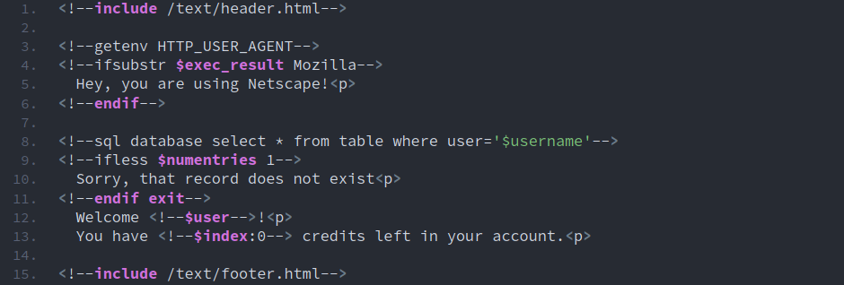
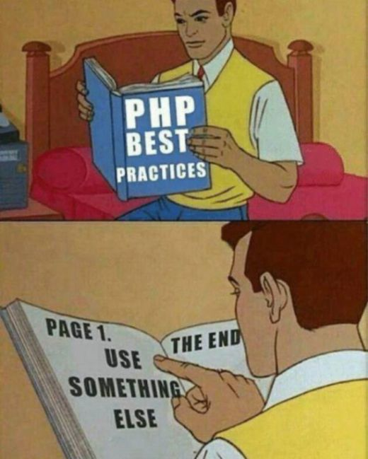

Escrito por [**Mehdi Zed**](https://jesuisundev.com/) - [versão original](https://www.jesuisundev.com/en/why-developers-hate-php)

Traduzido e adaptado por [**Bruno Bandeira**](https://brunobandeira.me/)

# Why developers hate PHP

PHP is the [most widely used language](https://w3techs.com/technologies/overview/programming_language) in the world for websites. It is also the most hated. And it’s pure hate. But why do so many developers hate it so much? Today we’re going to the origin of the hate, let’s see if it’s really justified.

## Don’t touch my PHP / Não toque no meu PHP

If I’m saying that PHP is hated by the whole world, it’s not my personal opinion. In the latest stack overflow survey, developers from all over the world put PHP in the [top 5 most dreaded languages](https://insights.stackoverflow.com/survey/2019#most-loved-dreaded-and-wanted). The latest Hired survey puts it squarely in the [top 2 most hated](https://hired.com/state-of-software-engineers#experience). There’s a lot more and I’m not even talking about what’s going on [Reddit](https://www.reddit.com/r/lolphp/). **If you’re a PHP developer since 20 years who came here on a crusade to crucify me on the altar of Symfony, please relax**. We’re here to talk, put the gun down. Well now on the contrary if you hate PHP with passion : take some pop-corns and sit down comfortably.

Once upon a time I was doing some Symfony2 myself. And I liked the whole Symfony thing, frankly, it’s not bad. I told this to a developer I met at a devops meetup. He was shocked, he was about to vomit, he looked at me like I just murdered a newborn baby. From now on I’m going to call him James to make it easier. So I immediately asked James a question: **why so much hatred?**

## PHP trouble past / PHP problema passado

To understand what’s coming next, you need context. In order to do that, let’s make a little rewind. It’s 1994 and [*Rasmus Lerdorf*](https://twitter.com/rasmus) is quickly coding a C tool suite. This suite of tools is used to manage his personal website. Rasmus is doing it just for his own need at the time. He doesn’t want to turn it into a programming language. **Nothing in this tool suite is designed to become one**. A year later Rasmus released this open source toolkit called then: PHP/FI. And it looked like this.

We’re far from what you’re using today in your huge PHP7 framework, aren’t we? Yet it all comes from there. For the rest of the story : the code is taken over by a dev team and PHP/FI2 is released in 1997. In 1998 a part is rewritten and PHP3 is released. In 1999 the core of PHP is totally rewritten to produce Zend. PHP4 follows the next year and PHP5 is released in 2004 with Zend2. **PHP6 got canceled because the development has turned into hell on earth**. Finally, through yet another major rewrite of the language: PHP7 is released in 2015. I remember at the time I was very excited. But originally, Rasmus was just coding his own thing . In 2003 he did an interview and told some incredible things.

“I really don’t like programming. I built this tool to program less so that I could simply reuse code … I don’t know how to stop it, there was never any intention to write a programming language […]. I don’t know how to write a programming language at all, I just kept adding the next logical step.”

"Eu realmente não gosto de programação. Eu criei essa ferramenta para programar menos, para poder simplesmente reutilizar o código ... não sei como pará-lo, nunca houve a intenção de escrever uma linguagem de programação [...]. Não sei escrever uma linguagem de programação, apenas continuei adicionando o próximo passo lógico ".

## Inconsistency and poor design / Inconsistência e design deficiente

Back in 2019 with our friend James from the meetup. He immediately started talking to me about the “disgusting” syntax of PHP. How the language is not typed. How the language is mostly unpredictable. Whether it’s on the use of operators or the incredible inconsistencies in function naming. I’ll spare you the list of technical problems because otherwise this article will take you all day to read.

If you really want to know everything I found you [the most pissed off person in the world against PHP](https://eev.ee/blog/2012/04/09/php-a-fractal-of-bad-design/). No, actually I think the person who hates PHP the most is actually [him](https://whydoesitsuck.com/why-does-php-suck/). All those posts validate what James was telling me. **Developers hate PHP because it’s a technically inconsistent language with a bad design**. When you compare it to other languages the contrast is obvious. If after reading these two articles you can’t admit that PHP have some problems it’s because it became [your religion](https://www.jesuisundev.com/en/religion-among-developers/). And I stopped trying to convince fanatics.

Using PHP it’s very easy to produce bad code. Other languages have many more restrictions. We also see a lot of security problems with PHP. And the problem is the same here. It’s very easy to make bad and insecure code with PHP. But PHP is not a security hole or doomed to ugly code if you code properly. **Developers hate PHP because you are more likely to get errors with a language that allows so much freedom**.

## Victim of its success / Vítima do seu sucesso

There is another important factor in this ambient hatred. **Developers hate PHP because it is used everywhere**. This blog runs on PHP7. Like most of the web I just need to host a dynamic page which is then cached. PHP does the job. Yes the language itself is not the best. Yes i could use a super duper stack. **But who cares?** It meets my needs in a fast and accessible way. It’s also for this reason that 80% of the web runs in PHP.

When I explained the same thing to James he started to go crazy. Like you and me, James have friends and family. These people frequently ask him for help with their professional and personal websites. **Guess what language always comes up on these people’s websites?** So James finds himself having to change things in PHP often. And he gets incredible headache from it.

With the advent of WordPress, which literally dominates the Internet, James will play with PHP for a long time. By the way, I’m talking to you as if this language could only handle a blog like mine but that’s obviously not the case. **Facebook, Wikipedia, Yahoo, Flickr, Tumblr all these sites run in PHP and welcome millions of users every month without flinching**. PHP does this very well and has been doing it for a long time.

## The future is now old man / O futuro é agora um homem velho

You’ve been hearing for 10 years that PHP is going to die. Yet he’s still here. Despite time and the latest hypothetical technology, it’s not moving. **Developers hate PHP because it is the opposite of [hype driven development](https://www.cygnismedia.com/blog/hype-driven-development/)**. In a profession where everyone invests quickly on the latest stuff, PHP is an old man who doesn’t want to sell his land. An old man who continues to dance insolently.

> The reports of my death are greatly exaggerated. [pic.twitter.com/dFTe63T4pG](https://pic.twitter.com/dFTe63T4pG )
    — php.net (@official_php) [August 14, 2019](https://twitter.com/official_php/status/1161431862931349504?ref_src=twsrc%5Etfw)

My discussion with James continues normally and all of a sudden he tells me something completely shocking. *“On top of that PHP is by far the slowest language you can find for web”*. When he said that I understood that James didn’t read anything on PHP since a long time.

## PHP evolves, not its reputation / PHP evolui, não sua reputação

In the minds of many developers, PHP has remained in version 4. When the language was unstable, with disastrous performance and non-existent OOP. **Developers hate PHP because they believe the language has been stagnating for 20 years**. When you know PHP today you know that it’s far from PHP4.

[PHP7 is faster than Python and Ruby](https://benchmarksgame-team.pages.debian.net/benchmarksgame/fastest/php.html). The language can be [strongly typed](https://stitcher.io/blog/typed-properties-in-php-74) if you wish. Tooling is also evolving with [static parsers](https://github.com/phpstan/phpstan) that have appeared in recent years. Frameworks like Symfony or Zend force good practices. A new version is released every year with a very precise agenda. Moreover [PHP7.4](https://www.php.net/index.php#id2019-09-05-1) is here with even more [performance](https://www.phoronix.com/scan.php?page=news_item&px=PHP-7.4-RC1-Released). Once again I won’t list everything that is happening in modern PHP for the sake of length. If you want to know everything I invite you to read [this article](https://stitcher.io/blog/php-in-2019). It’s time to change your vision on this language that has nothing to do with what it used to be.

**Developers hate PHP because it’s cool to hate PHP**. This language continues to have a really bad reputation because of it. And yes, there is a strong legacy and a lot of problems. But there is a lot of good stuff too for most of the websites.

## Epilogue

Most developers who hate PHP hate it out of elitism or ignorance. Either way it’s dumb. You have to choose a technology based on what you need. PHP is highly useful and powerful in many scenarios. And taking it out of the equation just because of its reputation is not a good idea.
