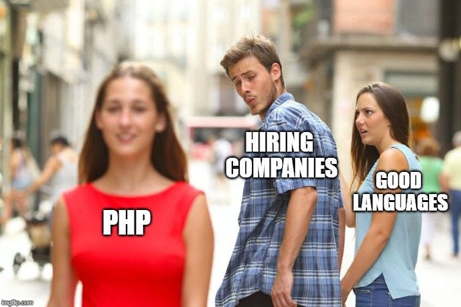
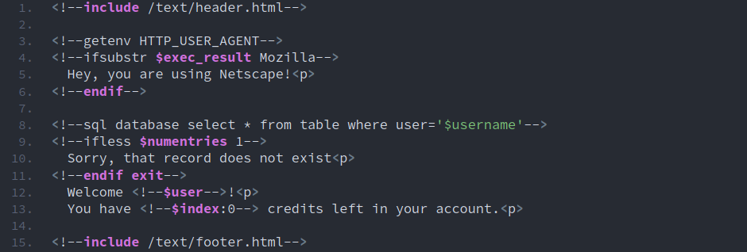
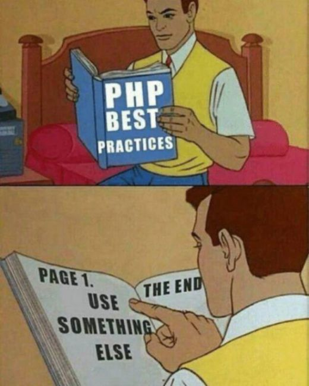
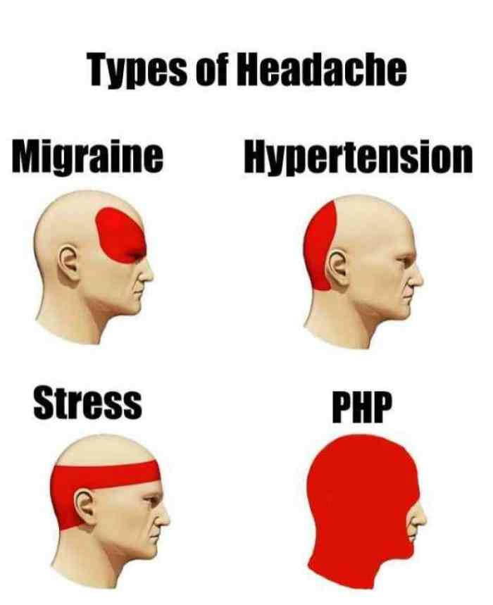

Escrito por [**Mehdi Zed**](https://jesuisundev.com/) - [versão original](https://www.jesuisundev.com/en/why-developers-hate-php)

Traduzido e adaptado por [**Bruno Bandeira**](https://brunobandeira.me/)

# Por que os desenvolvedores odeiam PHP

PHP é a [linguagem mais utilizada](https://w3techs.com/technologies/overview/programming_language) no mundo no desenvolvimento de sites. Mas também o mais odiado. E é puro ódio. Mas por que tantos desenvolvedores o odeiam? Hoje iremos para a origem do ódio, vamos ver se é realmente justificado.

## Não toque no meu PHP

Quando digo que o PHP é odiado pelo mundo inteiro, não é minha opinião pessoal. Na mais recente pesquisa feita pelo *Stack Overflow*, desenvolvedores de todo o mundo colocaram o PHP entre as [5 principais linguagens mais temidas](https://insights.stackoverflow.com/survey/2019#most-loved-dreaded-and-wanted). A última pesquisa encontrada coloca-o entre os [2 mais odiados](https://hired.com/state-of-software-engineers#experience). Há muito mais e nem estou falando sobre o que está acontecendo no [*Reddit*](https://www.reddit.com/r/lolphp/). **Se você é desenvolvedor PHP há 20 anos e veio aqui em uma cruzada para me crucificar no altar do *Symfony*, por favor relaxe**. Estamos aqui para conversar, abaixe a arma. Se, pelo contrário, você odeia o PHP com paixão: pegue algumas pipocas e sente-se confortavelmente.

Certa vez eu mesmo estava fazendo algo no *Symfony2*. E gostei da coisa toda do *Symfony*, francamente, não é ruim. Eu contei isso a um desenvolvedor que conheci em um encontro de *DevOps*. Ele ficou chocado, estava prestes a vomitar, olhou para mim como se eu tivesse acabado de matar um bebê recém-nascido. De agora em diante, vou chamá-lo de *James* para facilitar. Então eu imediatamente fiz uma pergunta ao James: **por que tanto ódio?**

## PHP problema passado

Para entender o que está por vir, você precisa do contexto. Para fazer isso, vamos retroceder um pouco. Estamos em 1994 e [*Rasmus Lerdorf*](https://twitter.com/rasmus) está codificando rapidamente um conjunto de ferramentas em *C*. Este conjunto de ferramentas é usado para gerenciar seu site pessoal. *Rasmus* está fazendo isso apenas por sua própria necessidade no momento. Ele não quer transformá-lo em uma linguagem de programação. **Nada neste conjunto de ferramentas foi projetado para se tornar uma**. Um ano depois, *Rasmus* lançou este kit de ferramentas de código aberto chamado então: **PHP/FI**. E parecia assim:

Estamos longe do que você está usando hoje em sua enorme estrutura PHP7, não é? No entanto, tudo vem de lá. Continuando a história: o código foi assumido por uma equipe de desenvolvimento e o **PHP/FI2** é lançado em 1997. Em 1998, uma parte é reescrita e o PHP3 é lançado. Em 1999, o núcleo do PHP foi totalmente reescrito para produzir o *Zend*. O PHP4 segue no ano seguinte e o PHP5 é lançado em 2004 com o *Zend2*. **O PHP6 foi cancelado porque o desenvolvimento se transformou em um inferno na Terra**. Finalmente, através de outra grande reescrita da linguagem: o PHP7 foi lançado em 2015. Lembro-me de que estava muito empolgado. Mas originalmente, *Rasmus* estava apenas codificando suas próprias coisas. Em 2003, ele fez uma entrevista e contou coisas incríveis.

> "Eu realmente não gosto de programação. Eu criei essa ferramenta para programar menos, para poder simplesmente reutilizar o código... não sei como pará-lo, nunca houve a intenção de escrever uma linguagem de programação [...]. Não sei escrever uma linguagem de programação, apenas continuei adicionando o próximo passo lógico".

## Inconsistência e design deficiente

Em 2019, eu estava com o nosso amigo James do encontro. Ele imediatamente começou a falar comigo sobre a sintaxe "nojenta" do PHP. Como a linguagem pode não ser tipada. Como a linguagem pode ser tão imprevisível. Seja no uso de operadores ou nas incríveis inconsistências na nomeação de funções. Pouparei a lista de problemas técnicos, pois, caso contrário, este artigo levará o dia todo para você ler.

Se você realmente quer saber tudo, você é a [pessoa mais irritada do mundo com o PHP](https://eev.ee/blog/2012/04/09/php-a-fractal-of-bad-design/). Não, na verdade acho que a pessoa que mais odeia o PHP é na verdade [ele](https://whydoesitsuck.com/why-does-php-suck/). Todas essas postagens validam o que James estava me dizendo. **Os desenvolvedores odeiam o PHP porque é uma linguagem tecnicamente inconsistente com um design ruim**. Quando você o compara com outras linguagens, o contraste é óbvio. Se depois de ler esses dois artigos, você não puder admitir que o PHP tem alguns problemas, é porque o PHP se tornou [sua religião](https://www.jesuisundev.com/en/religion-among-developers/). E eu parei de tentar convencer fanáticos.

Usando o PHP, é muito fácil produzir código incorreto. Outras linguagens têm muito mais restrições. Também vemos muitos problemas de segurança com o PHP. E o problema é o mesmo aqui. É muito fácil criar código inadequado e inseguro com PHP. Mas o PHP não é uma brecha na segurança, nem está fadado ao código feio, se o seu código estiver correto. **Os desenvolvedores odeiam o PHP porque é mais provável que você obtenha erros com uma linguagem que permita tanta liberdade**.

## Vítima do seu sucesso

Há outro fator importante nesse ódio todo. **Os desenvolvedores odeiam o PHP porque ele é usado em qualquer lugar**. Este blog é executado em PHP7. Como a maioria da web, eu só preciso hospedar uma página dinâmica que é armazenada em cache. PHP faz o trabalho. Sim, a linguagem em si não é a melhor. Sim, eu poderia usar uma *stack super duper*. **Mas quem se importa?** Atende às minhas necessidades de forma rápida e acessível. É também por esse motivo que 80% da web é executada em PHP.

Quando expliquei isso pro James, ele começou a enlouquecer. Como você e eu, James tem amigos e família. Essas pessoas freqüentemente pedem ajuda a ele em seus *sites* profissionais e pessoais. **Adivinha que linguagem sempre aparece nos *sites* dessas pessoas?** Então, James se vê tendo que mudar as coisas no PHP frequentemente. E ele tem uma dor de cabeça incrível com isso.

Com a chegada do *WordPress*, que literalmente dominou a Internet, James mexe com PHP por um longo tempo. A propósito, estou falando com você como se essa linguagem pudesse lidar apenas com um blog como o meu, mas obviamente não é o caso. **Facebook, Wikipedia, Yahoo, Flickr, Tumblr, todos esses sites são executados em PHP e recebem milhões de usuários todos os meses sem fraquejar**. O PHP faz isso muito bem e faz isso há muito tempo.

## O futuro é agora um homem velho

Você ouve há 10 anos que o PHP vai morrer. No entanto, ele ainda está aqui. Apesar do tempo e da mais recente tecnologia hipotética, ela não está se movendo. **Os desenvolvedores odeiam o PHP porque é o oposto do [desenvolvimento orientado pelo *hype*](https://www.cygnismedia.com/blog/hype-driven-development/)**. Em uma profissão em que todos investem rapidamente nas coisas mais recentes, o PHP é um homem velho que não quer vender sua terra. Um velho que continua a dançar insolentemente.

> The reports of my death are greatly exaggerated. [pic.twitter.com/dFTe63T4pG](https://pic.twitter.com/dFTe63T4pG )
    — php.net (@official_php) [August 14, 2019](https://twitter.com/official_php/status/1161431862931349504?ref_src=twsrc%5Etfw)

Minha discussão com James continuou normalmente e, de repente, ele me diz algo completamente chocante. *“Além disso, o PHP é de longe a linguagem mais lenta que você pode encontrar para a web”*. Quando ele disse isso, eu entendi, fazia muito tempo que ele não lia nada sobre PHP.

## PHP evoluiu, mas não sua reputação

Na mente de muitos desenvolvedores, o PHP permaneceu na versão 4. Quando a linguagem era instável, com desempenho desastroso e OOP inexistente. **Os desenvolvedores odeiam o PHP porque acreditam que a linguagem está estagnada há 20 anos**. Quando você conhece o PHP hoje, sabe que está longe do PHP4.

[PHP7 é mais rápido que *Python* e *Ruby*](https://benchmarksgame-team.pages.debian.net/benchmarksgame/fastest/php.html). A linguagem pode ser [fortemente tipada](https://stitcher.io/blog/typed-properties-in-php-74), se você desejar. As ferramentas também estão evoluindo com [analisadores estáticos](https://github.com/phpstan/phpstan) que apareceram nos últimos anos. Estruturas como *Symfony* ou *Zend* forçam boas práticas. Uma nova versão é lançada todos os anos com uma agenda muito precisa. Além disso, o [PHP7.4](https://www.php.net/index.php#id2019-09-05-1) está aqui com ainda mais [desempenho](https://www.phoronix.com/scan.php?page=news_item&px=PHP-7.4-RC1-Released). Mais uma vez, não listarei tudo o que está acontecendo no PHP moderno por uma questão de comprimento. Se você quiser saber tudo, convido você a ler [este artigo](https://stitcher.io/blog/php-in-2019). É hora de mudar sua visão sobre essa linguagem que não tem nada a ver com o que costumava ser.

**Os desenvolvedores odeiam o PHP porque é legal odiar o PHP**. Essa linguagem continua tendo uma reputação muito ruim por causa disso. E sim, há um legado forte e muitos problemas. Mas há muitas coisas boas também para a maioria dos sites.

## Epílogo / Conclusão

A maioria dos desenvolvedores que odeiam o PHP, odeiam ele por puro elitismo ou ignorância. De qualquer maneira, é burrice. Você tem que escolher a tecnologia com base no que você precisa. O PHP é altamente útil e poderoso em muitos cenários. E retirá-lo da equação apenas por causa de sua reputação não é uma boa ideia.
