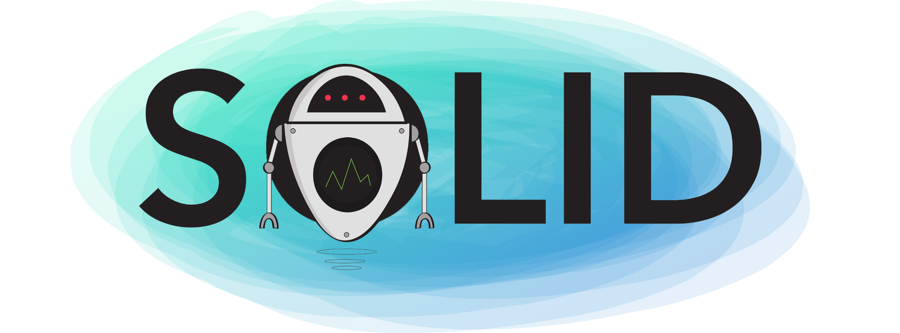
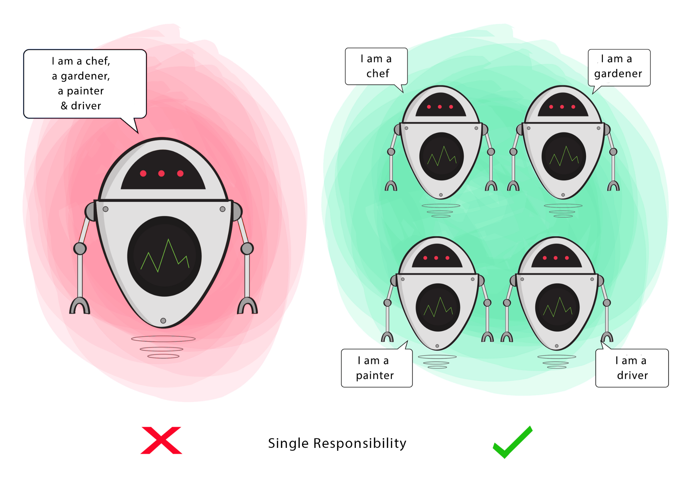
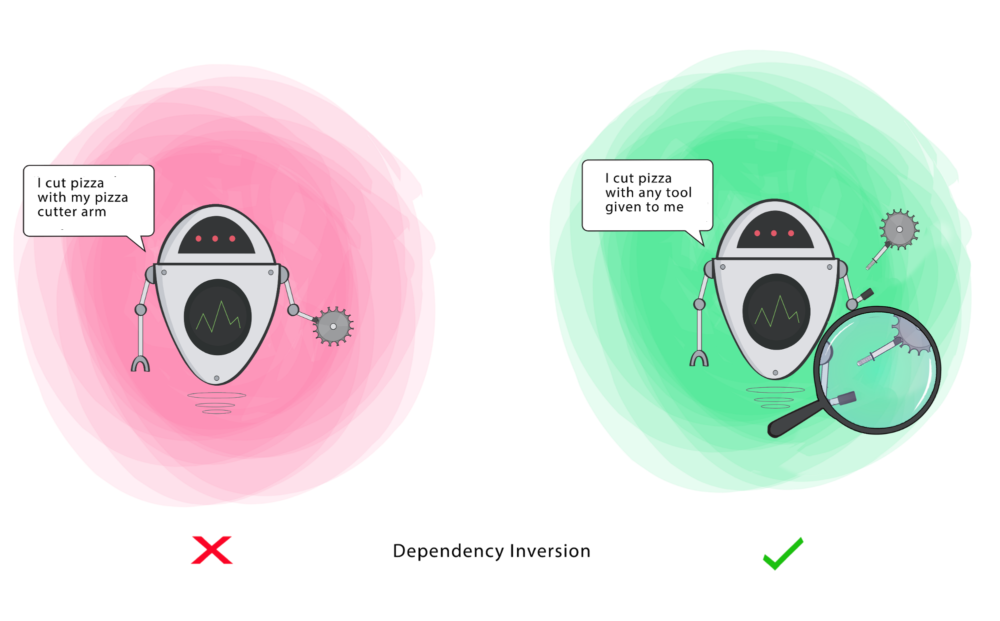

# Os princípios S.O.L.I.D em imagens

Written by **Ugonna Thelma** - [original version](https://medium.com/backticks-tildes/the-s-o-l-i-d-principles-in-pictures-b34ce2f1e898)

Translated and adapted by [**Bruno Bandeira**](https://github.com/brunobandev/translated-code)

Se você conhece a [programação orientada a objetos](https://en.wikipedia.org/wiki/Object-oriented_programming), provavelmente já ouviu falar dos princípios do [**SOLID**](https://en.wikipedia.org/wiki/SOLID).

Esses cinco princípios de desenvolvimento de software são diretrizes a serem seguidos na criação de software, para que seja mais fácil expandir e manter. Eles foram popularizados por um engenheiro de software, [Robert C. Martin](https://en.wikipedia.org/wiki/Robert_C._Martin).

Existem muitos artigos on-line excelentes sobre o **SOLID**, mas raramente vejo exemplos com imagens. Isso torna um pouco difícil para os aprendizes visuais como eu aprender enquanto estão envolvidos.

Portanto, o principal objetivo deste artigo é entender melhor esses princípios usando ilustrações e enfatizando o objetivo de cada princípio.

Veja bem, alguns desses princípios podem parecer semelhantes, mas não têm como foco **o mesmo objetivo**. É possível satisfazer um princípio enquanto viola o outro, mesmo sendo parecidos.

Para tornar isso simples de seguir, usarei a palavra **"Classe"**, mas observe que ela também pode se aplicar a uma **Função**, **Método** ou **Módulo** neste artigo.

Vamos começar!

## Os princípios do SOLID

### **S — Responsabilidade Única (*Single Responsibility*)**

> Uma classe deve ter uma única responsabilidade

Se uma classe tem muitas responsabilidades, aumenta a possibilidade de erros, pois fazer alterações em uma de suas responsabilidades pode afetar as outras sem que você saiba.

**Objetivo**

Esse princípio visa separar comportamentos para que, se surgirem erros como resultado de sua alteração, não afetem outros comportamentos não relacionados.

### **O — Aberto fechado (*Open-Closed*)**

> As classes devem ser abertas para extensão, mas fechadas para modificação

Alterar o comportamento atual de uma classe afetará todos os sistemas que usam essa classe.

Se você deseja que a Classe execute mais funções, a abordagem ideal é adicionar novas funções às que já existem, NÃO as alterar.

**Objetivo**

Este princípio visa estender o comportamento de uma classe sem alterar o comportamento existente. Isso serve para evitar erros quando a classe estiver sendo usada.

### **L — Substituição de Liskov (*Liskov Substitution*)**

> Se S é um subtipo de T, os objetos do tipo T em um programa podem ser substituídos por objetos do tipo S sem alterar nenhuma das propriedades desejáveis desse programa.

Quando uma classe **filho** não pode executar as mesmas ações que sua classe **pai**, isso pode causar erros.

Se você tem uma classe e cria outra classe a partir dela, ela se torna um **pai** e a nova classe se torna um **filho**. A classe **filho** deve poder fazer tudo o que a classe **pai** pode fazer. Esse processo é chamado de **herança**.

A classe **filho** deve ser capaz de processar as mesmas solicitações e entregar o mesmo resultado que a classe **pai**, ou pode entregar um resultado do mesmo tipo.

A figura mostra que a classe **pai** fornece café (pode ser qualquer tipo de café). É aceitável que a classe **filho** entregue Cappucino porque é um tipo específico de café, mas NÃO é aceitável entregar água.

Se a classe **filho** não atender a esses requisitos, significa que a classe **filho** foi completamente alterada e viola esse princípio.

**Objetivo**

Esse princípio visa impor consistência para que a classe pai ou sua classe filho possa ser usada da mesma maneira sem erros.

### **I — Segregação de Interface (*Interface Segregation*)**

> Os clientes não devem ser forçados a depender dos métodos que não usam.

Quando uma classe é obrigada a executar ações que não são úteis, é um desperdício e pode produzir bugs inesperados se a classe não tiver a capacidade de executar essas ações.

Uma classe deve executar apenas as ações necessárias para cumprir sua função. Qualquer outra ação deve ser removida completamente ou movida para outro lugar, se puder ser usada por outra Classe no futuro.

**Objetivo**

Esse princípio visa dividir um conjunto de ações em conjuntos menores, de modo que uma Classe execute APENAS o conjunto de ações que ele exige.

### **D — Inversão de Dependência (*Dependency Inversion*)**

> - Módulos de alto nível não devem depender de módulos de baixo nível. Ambos devem depender da abstração.

> - Abstrações não devem depender de detalhes. Os detalhes devem depender de abstrações.

Em primeiro lugar, vamos definir os termos usados aqui de maneira mais simples

**Módulo de alto nível (ou classe):** classe que executa uma ação com uma ferramenta.

**Módulo de baixo nível (ou classe):** a ferramenta necessária para executar a ação.

**Abstração:** representa uma interface que conecta as duas classes.

**Detalhes:** como a ferramenta funciona.

Este princípio diz que uma classe não deve ser fundida com a ferramenta usada para executar uma ação. Em vez disso, ele deve ser fundido à interface que permitirá que a ferramenta se conecte à Classe.

Ele também diz que a classe e a interface não devem saber como a ferramenta funciona. No entanto, a ferramenta precisa atender às especificações da interface.

**Objetivo**

Este princípio visa reduzir a dependência de uma classe de alto nível na classe de baixo nível, introduzindo uma interface.

# Sumário

Até agora, discutimos esses cinco princípios e destacamos seus objetivos. Eles existem para ajudá-lo a tornar seu código fácil de ajustar, estender e testar com pouco ou nenhum problema.

Muito obrigado pela leitura. Espero que você tenha uma idéia melhor sobre esse tópico e tenha se divertido tanto lendo isso quanto eu ao escrevê-lo.

Se você tiver alguma dúvida ou sugestão, deixe um comentário ou entre em contato comigo no Twitter[**@ugonna_t**](https://twitter.com/ugonna_t).

Thank you **Ugonna Thelma** for allowing me to do this.